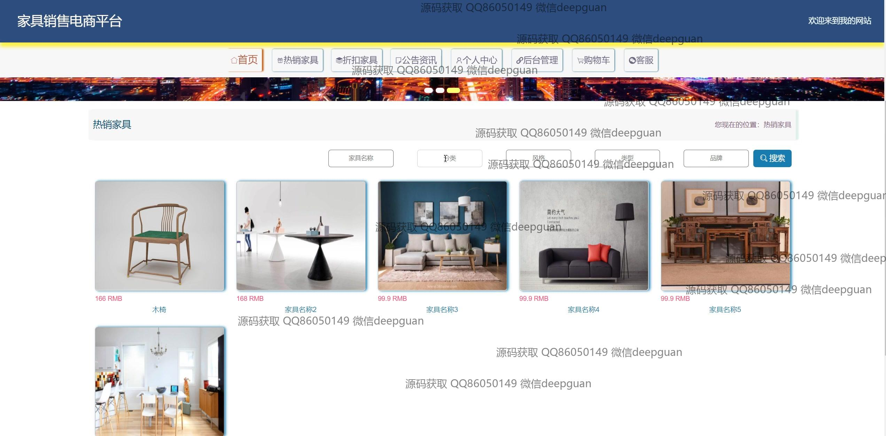
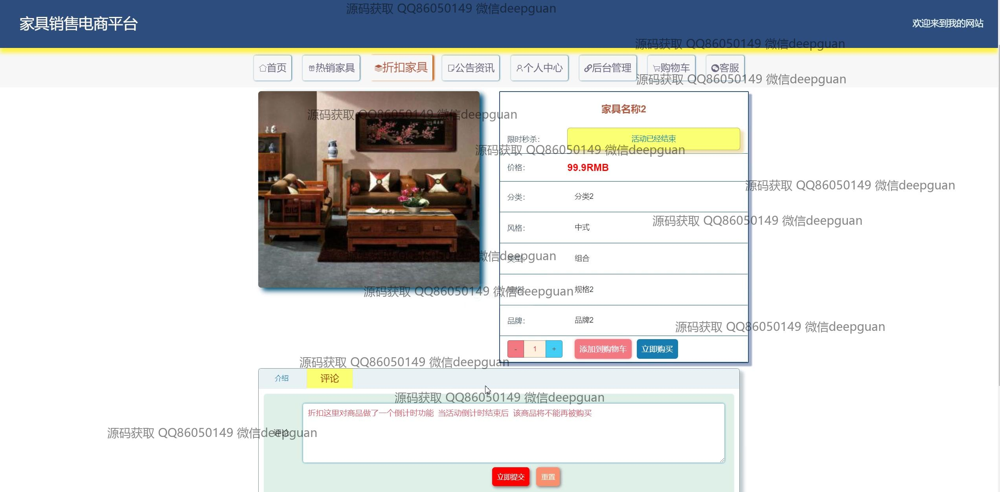

<h1 align="center">家具销售电商平台</h1>

## 简介
家具销售电商平台：用户可浏览商品、分类管理，进行评论互动，提供登录注册模块，后台支持订单、用户、折扣管理功能，符合现代风格设计和便捷操作需求。    --计算机毕业设计源码；毕设源码；java毕业设计源码

## 联系方式

<h3 align="center">获取完整代码与数据库文件 + 微信：deepguan QQ: 86050149 QQ群: 783742310</h3>

<h3 align="center">可帮忙远程部署 包运行成功！提供远程部署、修改代码、设计文档指导、代码讲解等服务！</h3>

## 功能介绍（完整见运行截图）
管理员：管理员可以通过后台管理界面进行登录、注册和退出操作。管理功能包括家具分类管理、折扣家具管理、订单评论管理以及用户管理。管理员可以查看和回复用户评论，管理商品信息，如添加、编辑、更新商品的分类、风格、类型及价格等，并支持上传图片和设置促销倒计时。导航菜单提供便捷的操作切换，支持对家具销售平台的全面运营管理。

用户：用户可以进行账号注册、登录并访问个人中心。个人中心功能包含用户信息管理，如修改头像、用户名、密码、联系方式等。用户可以浏览家具商品，使用搜索功能按分类、风格、类型、品牌筛选商品，并查看商品详情。购物功能包括添加至购物车、立即购买及订单管理。用户可管理收货地址、参与评论及收藏喜欢的商品，提高商品购买和评估的便捷性。

## 运行截图

本代码来源于网络,仅供学习参考使用!

